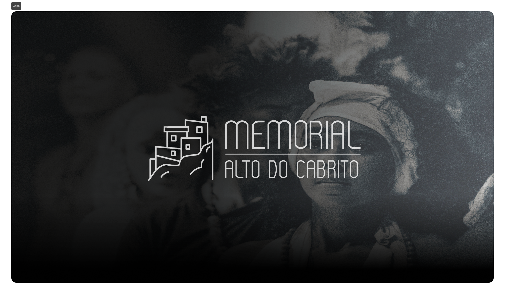

<p align="center">
  
</p>

<h1 align="center">Memorial Alto do Cabrito</h1>

<p align="center">
  Memorial digital do bairro Alto do Cabrito, em Salvador (BA) — um acervo interativo que preserva<br />
  e celebra a história, as figuras notáveis e a identidade da comunidade.<br />
  "Um espaço para preservar e celebrar a história da nossa comunidade."
</p>

---

## Stack

| Camada | Tecnologia |
|---|---|
| Framework | React 18 + TypeScript |
| Build | Vite |
| Roteamento | `react-router` v7 (Data Mode / `RouterProvider`) |
| Estilização | Tailwind CSS v4 |
| Animações | `motion` |
| Ícones | `lucide-react` |
| Data fetching | `@tanstack/react-query` |
| CMS | WordPress headless (REST API) |

## Estrutura do projeto

```
/src
  /app
    App.tsx              # RouterProvider
    routes.tsx            # definição de rotas
  /components              # componentes de UI por seção
  /pages                   # páginas roteadas
  /layouts                 # RootLayout
  /hooks                   # hooks de integração com o CMS (WordPress)
  /services                # chamadas HTTP à API WordPress
  /data/mocks              # dados mock (fallback quando a API não está configurada)
  /styles                  # theme.css, fonts.css
  /types                   # tipos do CMS
```

## Rotas

```
/                                    Home
/historia                           Nossa História (hub)
/historia/linha-do-tempo            Linha do tempo
/historia/linha-do-tempo/:slug      Marco histórico (detalhe)
/historia/figuras-notaveis          Figuras notáveis
/historia/figuras-notaveis/:id      Figura notável (detalhe)
/historia/grupo-comunitario         Grupo comunitário
/acervo                             Acervo (Fototeca, Videoteca, Audioteca, Biblioteca, Hemeroteca)
/projetos                           Projetos e campanhas
/projetos/:id                       Projeto (detalhe)
/mapa                                Mapa do bairro
/blog                                Blog (notícias, eventos, postagens)
/blog/:id                            Post (detalhe)
```

Rotas legadas (`/sobre`, `/midia`, `/noticias`, `/figuras-notaveis`, etc.) são redirecionadas automaticamente para as rotas atuais.

## Como rodar

```bash
npm install
npm run dev
```

Outros scripts:

```bash
npm run build      # build de produção (tsc -b && vite build)
npm run preview    # preview local do build
```

## Variáveis de ambiente

Crie um arquivo `.env.local` na raiz com:

```
VITE_WP_API_URL=http://memorialaltodocabrito.local
```

URL base da API REST do WordPress usada como CMS headless do site. Quando não configurada, os hooks caem para os dados mock em `src/data/mocks`.

## Deploy

O site é publicado na Vercel. Detalhes de infraestrutura/VPS estão documentados internamente (não versionados neste repositório).

## Licença

Uso interno — Memorial Alto do Cabrito.
